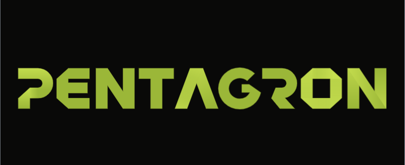

<div align="center">



### Autonomous AI Penetration Testing Framework

**Production-grade, fully automated security assessment platform powered by multi-agent AI orchestration**

[](https://github.com/heytherevibin/Pentagron/actions/workflows/ci.yml)
[](LICENSE)
[](https://golang.org)
[](https://nextjs.org)
[](https://docker.com)
[](https://neo4j.com)
[](https://github.com/heytherevibin/Pentagron/issues)

[Overview](#overview) · [Features](#key-features) · [Architecture](#architecture) · [Quick Start](#quick-start) · [Configuration](#configuration-reference) · [API](#api-reference) · [Contributing](#contributing)

</div>

---

## Overview

Pentagron is an enterprise-grade, fully autonomous penetration testing framework that orchestrates AI agents through a structured five-phase offensive pipeline — from passive reconnaissance through post-exploitation reporting. Built entirely in Go with a Next.js frontend, it combines multi-agent specialisation with evolutionary graph-based memory to deliver consistent, auditable, and context-aware security assessments.

### Problem Statement

Manual penetration testing is slow, inconsistent, and does not scale. Experienced security engineers spend significant time on repetitive reconnaissance and enumeration tasks before reaching the high-value analysis and exploitation work. Pentagron automates the mechanical phases, allowing human experts to focus on complex decision-making while maintaining full oversight through phase-gated approval workflows.

### Who It's For

| Audience | Use Case |
|----------|----------|
| Penetration Testers | Automate reconnaissance and enumeration; focus on exploitation |
| Red Teams | Run consistent, repeatable assessments across large scopes |
| Security Engineers | Internal network assessments and compliance validation |
| Security Researchers | Develop and test new offensive techniques in a structured framework |

> **Authorised use only.** See [Security & Legal](#security--legal).

---

## Key Features

### Intelligence & Learning

- **EvoGraph** — Evolutionary attack chain graph persisted in Neo4j. Every finding, failure, and decision is stored with semantic partitioning. Session B automatically inherits Session A's intelligence, enabling true cross-engagement learning.
- **Dual Memory** — pgvector 4-class semantic store (guide, task, research, result) combined with Neo4j graph relationships for both semantic and structural knowledge retrieval.
- **Context Summarisation** — Automatic conversation windowing with configurable byte limits prevents LLM context overflow during multi-hour engagements without losing critical findings.

### Agent Architecture

- **ReAct Loop** — Reasoning + Acting pattern implemented natively in Go. Each iteration: reason → select tool → execute → observe → adapt.
- **Reflector** — Automatic detection and correction of LLM free-text drift. When an agent produces narrative text instead of a structured tool call, the Reflector redirects it without interrupting the engagement.
- **Tiered Model Assignment** — Reasoning-heavy agents (orchestrator, pentester) use the most capable models. Fast agents (reporter, summariser) use lightweight models. Configurable per-agent model selection.
- **Phase-Gated Approvals** — Human-in-the-loop gates enforce a mandatory approval checkpoint before transitioning from informational phases to active exploitation.

### Tool Integration

- **200+ Kali Linux Tools** — Full offensive toolkit available via `shell` tool in the isolated Kali sandbox.
- **MCP Tool Abstraction** — Naabu, Nuclei, Metasploit, and SQLMap exposed as structured Model Context Protocol servers with typed inputs, output truncation, and error normalisation.
- **Docker-Native Execution** — All tool execution is isolated inside a purpose-built Kali container with `NET_ADMIN` and `NET_RAW` capabilities. The host system is never touched.

### Provider Support

- **5 LLM Providers** — Anthropic Claude, OpenAI, OpenRouter (300+ models), DeepSeek, Ollama (local/air-gapped). Automatic fallback chain on provider failure.
- **Dynamic Model Discovery** — Available models are fetched from all configured providers at startup. New models appear automatically without code changes.

### Observability

- **Real-time WebSocket Streaming** — Every agent thought, tool call, and finding is streamed to the dashboard in real time.
- **Guidance Injection** — Operators can send mid-engagement instructions to the running agent without interrupting the session.
- **Grafana Dashboards** — Agent performance metrics, token consumption, and tool execution statistics.
- **Langfuse Integration** — Full LLM call tracing, cost attribution, and prompt performance analytics.

---

## Architecture

```
╔══════════════════════════════════════════════════════════════════════════════╗
║                         PENTAGRON PLATFORM                                   ║
╠══════════════════════════════════════════════════════════════════════════════╣
║                                                                              ║
║   ┌─────────────────┐          ┌───────────────────────────────────────┐    ║
║   │  NEXT.JS 16 UI  │  WS/REST │         GO BACKEND (GIN)              │    ║
║   │                 │◄────────►│                                       │    ║
║   │  • Dashboard    │          │  ┌─────────────┐  ┌───────────────┐  │    ║
║   │  • Graph View   │          │  │ ORCHESTRATOR│  │ FLOW ENGINE   │  │    ║
║   │  • Agent Chat   │          │  │ AGENT       │  │ Flow→Task→    │  │    ║
║   │  • Approvals    │          │  │ (ReAct)     │  │ SubTask→      │  │    ║
║   │  • Reports      │          │  └──────┬──────┘  │ Action        │  │    ║
║   └─────────────────┘          │         │          └───────────────┘  │    ║
║                                │  ┌──────▼──────┐                     │    ║
║   ┌─────────────────┐          │  │ SPECIALIST  │  ┌───────────────┐  │    ║
║   │  LLM PROVIDERS  │          │  │   AGENTS    │  │   EVOGRAPH    │  │    ║
║   │                 │◄────────►│  │ pentester   │  │   Neo4j 5     │  │    ║
║   │  • Anthropic    │          │  │ recon       │  │ 5 node types  │  │    ║
║   │  • OpenAI       │          │  │ coder       │  │ cross-session │  │    ║
║   │  • OpenRouter   │          │  │ reporter    │  │ learning      │  │    ║
║   │  • DeepSeek     │          │  └──────┬──────┘  └───────────────┘  │    ║
║   │  • Ollama       │          │         │                             │    ║
║   └─────────────────┘          │  ┌──────▼──────┐  ┌───────────────┐  │    ║
║                                │  │    TOOL     │  │ VECTOR MEMORY │  │    ║
║                                │  │  REGISTRY   │  │ PostgreSQL 16 │  │    ║
║                                │  │  + EXECUTOR │  │  + pgvector   │  │    ║
║                                │  └──────┬──────┘  └───────────────┘  │    ║
║                                └─────────│─────────────────────────────┘    ║
║                                          │                                   ║
║   ┌──────────────────────────────────────▼──────────────────────────────┐   ║
║   │                    KALI LINUX SANDBOX                                │   ║
║   │                                                                      │   ║
║   │  shell (200+ tools)    ┌──────────┐ ┌──────────┐ ┌──────────────┐  │   ║
║   │  docker exec ─────────►│  NAABU   │ │  NUCLEI  │ │ METASPLOIT  │  │   ║
║   │                        │  :8000   │ │  :8002   │ │    :8003    │  │   ║
║   │                        └──────────┘ └──────────┘ └──────────────┘  │   ║
║   │                        ┌──────────┐                                 │   ║
║   │                        │  SQLMAP  │  (MCP servers — Go binaries)    │   ║
║   │                        │  :8001   │                                 │   ║
║   │                        └──────────┘                                 │   ║
║   └──────────────────────────────────────────────────────────────────────┘   ║
╚══════════════════════════════════════════════════════════════════════════════╝
```

### Architectural Layers

| Layer | Technology | Responsibility |
|-------|-----------|----------------|
| **Orchestration** | Go + Gin | Flow decomposition, agent routing, approval gates |
| **Agent Engine** | Go ReAct loop | Reasoning, tool selection, EvoGraph recording |
| **LLM Gateway** | Custom Provider interface | Multi-provider routing, fallback chain, health monitoring |
| **Tool Execution** | MCP + Docker exec | Structured tool I/O + arbitrary Kali toolkit access |
| **Intelligence Graph** | Neo4j 5 | EvoGraph chains, recon graph, cross-session memory |
| **Vector Memory** | PostgreSQL + pgvector | 4-class semantic similarity search |
| **Frontend** | Next.js 15 + TypeScript | Real-time dashboard, graph visualisation, approval UI |

---

## Five-Phase Pipeline

| Phase | Mode | Description | Primary Tools |
|-------|------|-------------|---------------|
| **1. Reconnaissance** | Automated | Domain discovery, port scanning, HTTP probing, technology fingerprinting, vulnerability scanning, secret detection | subfinder, naabu, httpx, nuclei (9,000+ templates), katana |
| **2. Analysis** | AI-Driven | CVE correlation, attack path classification, exploit feasibility scoring, EvoGraph query | LLM reasoning, Neo4j Cypher |
| **3. Exploitation** | Approved | CVE-based exploits, credential attacks, SQL injection, web application attacks | Metasploit, SQLMap, Hydra, custom exploits |
| **4. Post-Exploitation** | Auto (after exploitation) | Session enumeration, privilege escalation, credential harvesting, lateral movement reachability | `msf_sessions_list`, `msf_session_cmd`, `shell` |
| **5. Reporting** | Automated | MITRE ATT&CK mapping, CVSS scoring, compliance mapping, remediation roadmap | Reporter agent, LLM synthesis |

### Attack Path Classification

The orchestrator classifies each objective into one of three attack paths at session start, dynamically adjusting tool selection and prompting strategy:

- **`cve_exploit`** — Known CVE with available exploit; Metasploit-first workflow
- **`brute_force`** — Credential attack against exposed services (SSH, RDP, SMB, HTTP)
- **`unclassified`** — Web application attacks (SQLi, XSS, SSRF, file upload, IDOR)

---

## Tech Stack

| Component | Technology | Version |
|-----------|-----------|---------|
| Backend language | Go | 1.23+ |
| HTTP framework | Gin | 1.10 |
| ORM | GORM | 1.25 |
| LLM — Anthropic | anthropic-sdk-go | 0.2.0-alpha |
| LLM — OpenAI compat. | openai-go | 0.1.0-alpha |
| MCP protocol | mark3labs/mcp-go | 0.18 |
| Docker SDK | docker/docker | 27.4 |
| Graph database | Neo4j | 5 |
| Vector database | PostgreSQL + pgvector | 16 |
| Cache | Redis | 7 |
| Frontend | Next.js + TypeScript | 15 |
| Styling | Tailwind CSS | 3.4 |
| WebSocket | gorilla/websocket | 1.5 |
| Configuration | Viper | 1.19 |
| Logging | Uber Zap | 1.27 |
| Auth | golang-jwt/jwt | v5 |
| Observability | Grafana + Langfuse | latest |

---

## Prerequisites

| Requirement | Minimum Version | Notes |
|-------------|----------------|-------|
| Docker Engine | 24.0+ | Docker Compose v2 required |
| Docker Compose | 2.20+ | Included with Docker Desktop |
| Available RAM | 8 GB | 16 GB recommended for Kali image |
| Available Disk | 20 GB | Kali image is ~8 GB |

**LLM API Keys** — At least one of:

- `ANTHROPIC_API_KEY` — [console.anthropic.com](https://console.anthropic.com)
- `OPENAI_API_KEY` — [platform.openai.com](https://platform.openai.com)
- `OPENROUTER_API_KEY` — [openrouter.ai](https://openrouter.ai)
- `DEEPSEEK_API_KEY` — [platform.deepseek.com](https://platform.deepseek.com)
- Ollama running locally (no API key required)

---

## Quick Start

```bash
# 1. Clone the repository
git clone https://github.com/heytherevibin/Pentagron.git
cd Pentagron

# 2. Configure environment
cp .env.example .env
# Edit .env — add your LLM API key(s) and set ADMIN_PASSWORD

# 3. Build and start all services
make build
make up

# 4. Verify all services are healthy
curl http://localhost:8080/health
# → {"status":"ok"}

# 5. Open the dashboard
open http://localhost:3000
# Login: admin@pentagron.local / <your ADMIN_PASSWORD>
```

### Verify Individual Services

```bash
# Authenticate and get a token
TOKEN=$(curl -s -X POST http://localhost:8080/api/auth/login \
  -H "Content-Type: application/json" \
  -d '{"email":"admin@pentagron.local","password":"changeme"}' \
  | jq -r '.token')

# LLM provider health
curl http://localhost:8080/api/health/providers \
  -H "Authorization: Bearer $TOKEN"

# MCP server health
curl http://localhost:8080/api/health/mcp \
  -H "Authorization: Bearer $TOKEN"

# List available LLM models
curl http://localhost:8080/api/models \
  -H "Authorization: Bearer $TOKEN"

# Neo4j browser
open http://localhost:7474
# bolt://localhost:7687 | neo4j / pentagron
```

### Development Mode (Hot Reload)

```bash
make dev
# Backend: air on :8080  |  Frontend: next dev on :3000
```

### With Observability Stack

```bash
make obs-up
# Grafana:  http://localhost:3001  (admin / admin)
# Langfuse: http://localhost:4000
```

---

## Configuration Reference

Copy `.env.example` to `.env` and configure. Variables marked **Required** have no safe default.

### Server

| Variable | Default | Description |
|----------|---------|-------------|
| `SERVER_PORT` | `8080` | HTTP server port |
| `GIN_MODE` | `release` | `debug` or `release` |
| `LOG_LEVEL` | `info` | `debug`, `info`, `warn`, `error` |
| `JWT_SECRET` | — | **Required.** Random string ≥ 32 chars |
| `CORS_ORIGIN` | `http://localhost:3000` | Frontend origin for CORS |
| `ADMIN_EMAIL` | `admin@pentagron.local` | Default admin account email |
| `ADMIN_PASSWORD` | `changeme` | **Required.** Change before deployment |

### LLM Providers

| Variable | Description |
|----------|-------------|
| `LLM_DEFAULT_PROVIDER` | `anthropic` \| `openai` \| `openrouter` \| `deepseek` \| `ollama` |
| `LLM_DEFAULT_MODEL` | Default model ID (e.g. `claude-sonnet-4-6`) |
| `ANTHROPIC_API_KEY` | Anthropic API key |
| `OPENAI_API_KEY` | OpenAI API key |
| `OPENROUTER_API_KEY` | OpenRouter API key |
| `DEEPSEEK_API_KEY` | DeepSeek API key |
| `OLLAMA_BASE_URL` | Ollama URL (default: `http://localhost:11434`) |

### Per-Agent Model Overrides

| Variable | Default | Tier |
|----------|---------|------|
| `AGENT_MODEL_ORCHESTRATOR` | `claude-opus-4-6` | Tier 1 — reasoning-heavy |
| `AGENT_MODEL_PENTESTER` | `claude-opus-4-6` | Tier 1 — reasoning-heavy |
| `AGENT_MODEL_RECON` | `claude-sonnet-4-6` | Tier 2 — balanced |
| `AGENT_MODEL_CODER` | `claude-sonnet-4-6` | Tier 2 — balanced |
| `AGENT_MODEL_REPORTER` | `claude-haiku-4-5-20251001` | Tier 3 — fast |
| `AGENT_MODEL_SUMMARIZER` | `claude-haiku-4-5-20251001` | Tier 3 — fast |

### Agent Behaviour

| Variable | Default | Description |
|----------|---------|-------------|
| `AGENT_MAX_ITERATIONS` | `50` | Maximum ReAct loop iterations per task |
| `AGENT_REQUIRE_APPROVAL` | `true` | Require human approval before exploitation phase |
| `EVOGRAPH_ENABLED` | `true` | Persist attack chains to Neo4j |
| `VECTOR_STORE_ENABLED` | `true` | Enable pgvector semantic memory |
| `SUMMARIZER_LAST_SEC_BYTES` | `51200` | Context summarisation threshold (50 KB) |
| `SUMMARIZER_MAX_QA_BYTES` | `65536` | Aggressive summarisation threshold (64 KB) |

### MCP Servers

| Variable | Default |
|----------|---------|
| `MCP_NAABU_URL` | `http://mcp-naabu:8000` |
| `MCP_SQLMAP_URL` | `http://mcp-sqlmap:8001` |
| `MCP_NUCLEI_URL` | `http://mcp-nuclei:8002` |
| `MCP_METASPLOIT_URL` | `http://mcp-metasploit:8003` |

### Worker Node mTLS

| Variable | Default | Description |
|----------|---------|-------------|
| `WORKER_MTLS_ENABLED` | `false` | Start a second TLS listener on `:8443` for worker nodes |
| `WORKER_TLS_CA` | — | Path to PEM-encoded CA certificate (shared by server + workers) |
| `WORKER_TLS_CERT` | — | Path to this process's PEM-encoded certificate |
| `WORKER_TLS_KEY` | — | Path to this process's PEM-encoded private key |

---

## API Reference

All protected endpoints require `Authorization: Bearer <token>`.

### Authentication

| Method | Endpoint | Body | Description |
|--------|----------|------|-------------|
| `POST` | `/api/auth/login` | `{email, password}` | Get JWT token |
| `POST` | `/api/auth/logout` | — | Invalidate session |

### Projects

| Method | Endpoint | Description |
|--------|----------|-------------|
| `GET` | `/api/projects` | List all projects |
| `POST` | `/api/projects` | Create `{name, description?, scope?}` |
| `GET` | `/api/projects/:id` | Get project details |
| `PUT` | `/api/projects/:id` | Update project |
| `DELETE` | `/api/projects/:id` | Soft-delete project |

### Flows

| Method | Endpoint | Description |
|--------|----------|-------------|
| `GET` | `/api/projects/:id/flows` | List flows for a project |
| `POST` | `/api/projects/:id/flows` | Create `{name, objective}` |
| `GET` | `/api/flows/:id` | Get flow with tasks and status |
| `DELETE` | `/api/flows/:id` | Delete flow |
| `POST` | `/api/flows/:id/cancel` | Cancel running flow |
| `GET` | `/api/flows/:id/approvals` | List pending approvals |
| `POST` | `/api/flows/:id/approve` | Approve phase transition |
| `POST` | `/api/flows/:id/reject` | Reject phase transition |

### Settings

| Method | Endpoint | Description |
|--------|----------|-------------|
| `GET` | `/api/settings/general` | Get general configuration |
| `PUT` | `/api/settings/general` | Update general configuration |
| `GET` | `/api/settings/llm` | Get LLM provider configs (masked keys) |
| `PUT` | `/api/settings/llm` | Update LLM provider configs |
| `POST` | `/api/settings/llm/test` | Test LLM provider connectivity |
| `GET` | `/api/settings/mcp` | Get MCP server configs |
| `PUT` | `/api/settings/mcp` | Update MCP server configs |
| `POST` | `/api/settings/mcp/test` | Test MCP server connectivity |

### Users (Admin Only)

| Method | Endpoint | Description |
|--------|----------|-------------|
| `GET` | `/api/users` | List all users |
| `POST` | `/api/users` | Create user `{email, password, role}` |
| `PUT` | `/api/users/:user_id` | Update user role |
| `DELETE` | `/api/users/:user_id` | Deactivate user |
| `POST` | `/api/users/:user_id/reset-password` | Reset user password |

### System

| Method | Endpoint | Description |
|--------|----------|-------------|
| `GET` | `/health` | Health check (no auth) |
| `GET` | `/api/models` | All available LLM models |
| `GET` | `/api/health/providers` | LLM provider health |
| `GET` | `/api/health/mcp` | MCP server health |
| `GET` | `/api/health/all` | Aggregate health (LLM + MCP + DB + Docker) |
| `GET` | `/api/activity` | Recent activity feed |

### Worker Nodes

| Method | Endpoint | Description |
| ------ | -------- | ----------- |
| `POST` | `/api/workers/register` | Register worker node `{id, hostname, capabilities[]}` |
| `GET` | `/api/workers/:worker_id/tasks` | Poll for next pending task (heartbeat) |
| `POST` | `/api/workers/:worker_id/results` | Submit tool execution result `{task_id, output, error, success}` |

Worker nodes connect to the plain HTTP port (`:8080`) by default. When `WORKER_MTLS_ENABLED=true` and all three cert paths are set, the server also listens on `:8443` with mutual TLS (TLS 1.3, `RequireAndVerifyClientCert`). Pass `-tls-ca/-tls-cert/-tls-key` flags to the worker binary to enable the mTLS client.

### WebSocket Endpoints

| Endpoint | Description |
|----------|-------------|
| `WS /ws/agent/:session_id?flow_id=<id>` | Agent chat — bidirectional |
| `WS /ws/logs/:flow_id` | Execution log stream — read-only |

---

## WebSocket Events

All events are JSON-encoded `WSMessage` objects: `{type, session_id, flow_id, payload, timestamp}`.

### Server → Client

| Type | Payload | Description |
|------|---------|-------------|
| `agent_thought` | `{text}` | Agent reasoning step |
| `tool_call` | `{name, input}` | Tool invocation |
| `tool_result` | `{name, output, success, duration_ms}` | Tool result |
| `phase_change` | `{from, to, rationale}` | Phase transition |
| `approval_request` | `{id, phase, description, payload}` | Awaiting approval |
| `final_answer` | `{text}` | Task completion |
| `error` | `{message}` | Error notification |

### Client → Server

| Type | Payload | Description |
|------|---------|-------------|
| `user_guidance` | `{text}` | Inject mid-session guidance to running agent |

---

## EvoGraph Schema

Nodes in Neo4j are linked: `(AttackChain)-[:HAS_NODE]->(ChainStep | ChainFinding | ChainDecision | ChainFailure)`

| Node Type | Key Properties | Description |
|-----------|---------------|-------------|
| `AttackChain` | `id, session_id, project_id, objective` | Root node per session |
| `ChainStep` | `id, content, iteration` | Individual reasoning step |
| `ChainFinding` | `id, tool, output, severity` | Discovery — sorted `critical→info` |
| `ChainDecision` | `id, rationale, from_phase, to_phase` | Phase transition rationale |
| `ChainFailure` | `id, tool, error, lesson_learned` | Failed attempt with lessons |

`FormatContext()` returns a severity-sorted, semantically partitioned string injected into every agent prompt for full session awareness. Cross-session intelligence is pulled via `MATCH (f:ChainFinding) WHERE f.severity IN ['critical','high']`.

---

## Service Ports

| Service | Port | URL |
|---------|------|-----|
| Backend API | 8080 | `http://localhost:8080` |
| Frontend | 3000 | `http://localhost:3000` |
| Neo4j Browser | 7474 | `http://localhost:7474` |
| Neo4j Bolt | 7687 | `bolt://localhost:7687` |
| PostgreSQL | 5432 | `postgresql://localhost:5432` |
| Redis | 6379 | `redis://localhost:6379` |
| MCP Naabu | 8000 | `http://localhost:8000` |
| MCP SQLMap | 8001 | `http://localhost:8001` |
| MCP Nuclei | 8002 | `http://localhost:8002` |
| MCP Metasploit | 8003 | `http://localhost:8003` |
| Grafana | 3001 | `http://localhost:3001` |
| Langfuse | 4000 | `http://localhost:4000` |

---

## Makefile Reference

```bash
make help           # Show all available targets with descriptions
make dev            # Start with hot reload (air + next dev)
make up             # Start production stack (detached)
make down           # Stop all services
make build          # Build all Docker images
make rebuild        # Force rebuild (no cache)
make obs-up         # Start Grafana + Langfuse observability stack
make logs           # Tail all service logs
make logs-backend   # Tail backend logs only
make migrate        # Run database migrations
make db-shell       # Open psql interactive shell
make neo4j-shell    # Open Neo4j cypher-shell
make test           # Run Go tests with race detector
make test-cover     # Run tests and open HTML coverage report
make lint           # Run golangci-lint
make fmt            # Format all Go code
make tidy           # Run go mod tidy
make clean          # Remove containers and volumes — DESTRUCTIVE
make env-setup      # Copy .env.example → .env (non-destructive)
```

---

## Project Structure

```
pentagron/
├── CLAUDE.md                        # Claude Code project instructions
├── CHANGELOG.md                     # Version history (Keep a Changelog format)
├── LICENSE                          # MIT License
├── Makefile                         # Developer workflow — 20+ targets
├── README.md                        # This file
├── .env.example                     # Environment configuration template
├── .gitignore
├── docker-compose.yml               # Core services (10 containers)
├── docker-compose.dev.yml           # Hot-reload overrides
├── docker-compose.observability.yml # Grafana + Langfuse
│
├── .claude/                         # Claude Code intelligence (version-controlled)
│   ├── settings.local.json          # Permission configuration
│   ├── memory/MEMORY.md             # Project memory
│   └── plans/                       # Architecture plans archive
│
├── backend/                         # Go monolith
│   ├── cmd/server/main.go           # Server entrypoint — wires all deps
│   ├── cmd/worker/main.go           # Air-gapped worker node
│   └── pkg/
│       ├── agent/                   # ReAct loop, Reflector, Summarizer
│       ├── api/                     # Gin router, handlers, JWT middleware
│       ├── config/                  # Viper typed configuration
│       ├── database/                # GORM models (9 entities), Postgres, Neo4j
│       ├── docker/                  # Kali sandbox exec client
│       ├── flow/                    # Flow/Task orchestration engine
│       ├── llm/                     # Multi-provider LLM abstraction (5 providers)
│       ├── mcp/                     # MCP HTTP/SSE client + manager
│       ├── memory/                  # EvoGraph (Neo4j) + pgvector semantic store
│       ├── recon/                   # Six-phase recon pipeline orchestrator
│       ├── templates/prompts/       # Agent prompt templates (pentester, recon, coder, reporter, orchestrator)
│       ├── tools/                   # Tool registry + executor (MCP + shell)
│       └── ws/                      # WebSocket hub — broadcast + guidance injection
│
├── frontend/                        # Next.js 15 + TypeScript
│   ├── src/
│   │   ├── app/
│   │   │   ├── login/               # Public login page
│   │   │   ├── setup/               # First-run setup wizard
│   │   │   └── (authenticated)/     # Protected route group
│   │   │       ├── layout.tsx       # TopNav + CommandPalette wrapper
│   │   │       ├── page.tsx         # Dashboard (stats + projects + activity)
│   │   │       ├── projects/new/    # Create project
│   │   │       ├── projects/[id]/   # Project detail + flows
│   │   │       ├── flows/[id]/      # Flow mission control (3-panel)
│   │   │       └── settings/        # Admin panel (6 tabs)
│   │   ├── components/              # 17 UI primitives + 3 composites
│   │   ├── hooks/                   # useAgentWebSocket
│   │   ├── lib/api.ts               # Typed Axios client with JWT interceptors
│   │   └── types/index.ts           # Shared domain types
│   ├── public/
│   │   ├── manifest.json            # PWA manifest
│   │   ├── sw.js                    # Service worker
│   │   └── icons/                   # PWA icons (SVG)
│   ├── middleware.ts                 # Cookie-based auth route protection
│   └── Dockerfile
│
├── mcp-servers/                     # Go MCP server binaries
│   ├── naabu/                       # Port scanning — :8000
│   ├── sqlmap/                      # SQL injection — :8001
│   ├── nuclei/                      # Vulnerability scanning — :8002
│   └── metasploit/                  # Exploitation — :8003
│
└── docker/
    ├── kali/Dockerfile              # 200+ tool Kali Linux image
    └── postgres/init.sql            # pgvector + uuid-ossp initialisation
```

---

## Security & Legal

### Authorised Use Only

Pentagron is a powerful offensive security tool. **You must have explicit, written authorisation before running any assessment against any system or network.**

Unauthorised access to computer systems is illegal under, among others:

- **United States** — Computer Fraud and Abuse Act (18 U.S.C. § 1030)
- **United Kingdom** — Computer Misuse Act 1990
- **European Union** — Directive 2013/40/EU on Attacks Against Information Systems
- **International** — Budapest Convention on Cybercrime

The authors and contributors of Pentagron accept no liability for any misuse of this software.

### Deployment Hardening

- Change `ADMIN_PASSWORD` and `JWT_SECRET` before any non-local deployment
- The Docker socket mount grants elevated host access — deploy only on trusted infrastructure
- Do not expose port 8080 to untrusted networks without a TLS-terminating reverse proxy (nginx, Caddy, Traefik)
- Enable network policies to restrict inter-container communication beyond what Compose defines
- Store `.env` outside the repository — it is listed in `.gitignore`

### Responsible Disclosure

If you discover a security vulnerability in Pentagron itself, please report it privately via [GitHub Security Advisories](https://github.com/heytherevibin/Pentagron/security/advisories/new) rather than opening a public issue.

---

## Contributing

Contributions are welcome. Please follow these guidelines.

### Branch Strategy

| Branch | Purpose |
|--------|---------|
| `main` | Stable releases only — protected |
| `develop` | Integration branch — base for all PRs |
| `feature/*` | New features — branch from `develop` |
| `fix/*` | Bug fixes — branch from `develop` or `main` |
| `docs/*` | Documentation only |

### Pull Request Process

1. Fork the repository and create your branch from `develop`
2. Ensure `make test` passes (zero failures, zero race conditions)
3. Ensure `make lint` passes (zero errors)
4. Update `CHANGELOG.md` under `[Unreleased]`
5. Open a pull request against `develop` with a clear description of the change and its motivation
6. Maintainers will review within 5 business days

### Code Standards

- **Go** — `gofmt` formatted; `golangci-lint` clean; all errors handled explicitly
- **TypeScript** — strict mode enabled; no untyped `any` without justification comment
- **Commits** — Conventional Commits format: `feat:`, `fix:`, `docs:`, `chore:`, `refactor:`, `test:`
- **Security** — No secrets, hard-coded IPs, or domain names in source code

---

## License

Copyright © 2025 Pentagron Contributors

Released under the [MIT License](LICENSE). See `LICENSE` for the full text including the authorised-use-only notice.

---

<div align="center">
<sub>Built for security professionals who demand precision, repeatability, and speed.</sub>
</div>
